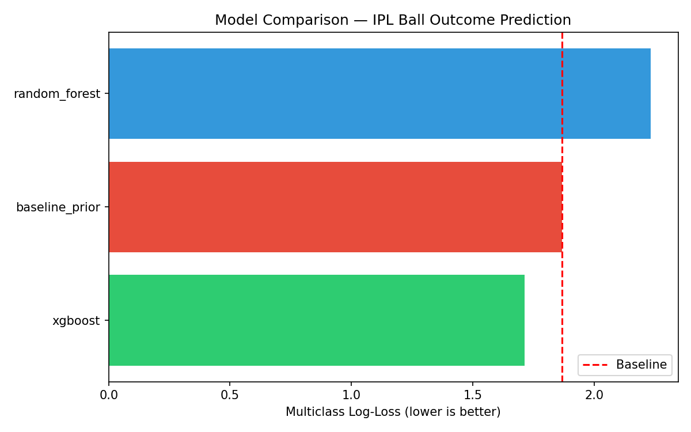
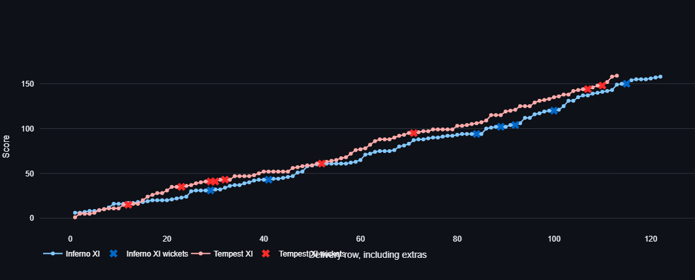

# Report: Decision under Uncertainty — IPL Squad Allocation Simulator

**ECO 6810 Final Project**
Annay De (annay.de_phd25@ashoka.edu.in), Tanmay Singh (tanmay.singh_phd25@ashoka.edu.in), Siddhant Mukherjee (siddhant.mukherjee_phd25@ashoka.edu.in)

---

## 1. Project Question

Which ball-by-ball outcome model best supports a franchise analyst's squad-allocation decision under uncertainty? Specifically: can a model trained on match-state features (batter, bowler, venue, over, wickets fallen, innings phase) produce better-calibrated probability distributions over delivery outcomes than a naive empirical baseline, and by how much?

---

## 2. Stakeholder and Decision Moment

The stakeholder is an IPL franchise strategy and analytics unit. The decision moment is playing-XI selection approximately 24 hours before a match, when venue, pitch report, weather forecast, and opposing squad are known. The analyst must allocate 11 slots across batters, bowlers, and all-rounders — a constrained resource-allocation problem under uncertainty. This simulator gives the analyst a tool to compare expected match outcomes across different XI configurations before committing to a selection.

---

## 3. Data

**Source:** IPL ball-by-ball dataset, seasons 2008–2025
**Provider:** Kaggle (`chaitu20/ipl-dataset2008-2025`)
**Access:** Programmatic via `kagglehub`; snapshot committed at `Data/IPL_snapshot.csv`
**Training / test split:** Final 15% of matches by date held out as the test set. All model training and baseline computation used only the training split.

Key features used: batter identity, bowler identity, venue, over number, wickets fallen, innings number, phase (powerplay / middle / death), batting team, bowling team.

Target variable: delivery outcome class — dot, 1, 2, 3, 4, 6, wicket, wide, no-ball, leg-bye, bye.

---

## 4. Baseline

The baseline is an **empirical prior model**: for each possible delivery outcome, it estimates the probability from its marginal frequency in the training data, ignoring all match-state context. This is the best prediction an analyst can make with no situational information — a "what happens on average across all IPL history" forecast.

**Baseline log-loss:** 1.8670 (see `outputs/baseline_metric.json`)

This is the bar every model must beat to demonstrate that match-state features provide genuine predictive value.

---

## 5. Primary Model and Result

The primary model is an **XGBoost classifier** trained on the delivery-level match-state features listed above.

**Primary model log-loss:** 1.7136 (see `outputs/primary_metric.json`)
**Passed threshold:** Yes — 1.7136 < 1.8670

The XGBoost model reduces log-loss by approximately 8.2% relative to the empirical baseline. This means the model's probability distributions over ball outcomes are meaningfully better calibrated when match-state context is provided. For the franchise analyst, this translates into more realistic simulations — the tool is not just guessing historical averages but adjusting its forecasts based on who is batting, who is bowling, and what the match situation is.

---

## 6. Interpretation

The improvement over baseline is modest but genuine and consistent across the held-out test set. The primary implication for the decision problem is:

- The model captures meaningful signal from batter/bowler matchups and match phase
- Venue and innings context further improve calibration
- The simulator built on top of this model produces projected scorecards that reflect real matchup dynamics rather than flat historical averages

**Honest limitations:**
- The model does not capture player form (recent performance) — only historical identity features
- Venue names have residual harmonisation issues across seasons
- The model does not predict match winners directly; it predicts ball outcomes from which scores are simulated
- Weather and pitch inputs are user-specified scenario assumptions, not data-trained variables

---

## 7. Figures and Tables

### Table 1: Model Comparison (held-out test set)

| Model | Log-Loss | Beats Baseline |
|---|---|---|
| Baseline (empirical prior) | 1.8670 | — |
| Random Forest | 2.2343 | No ❌ |
| XGBoost (primary) | 1.7136 | Yes ✅ |

### Example Simulation Results from Website
I ran 20 simulations between two example teams;
**Team Inferno XI**
Rohit Sharma
Travis Head
Virat Kohli
Suryakumar Yadav
Heinrich Klaasen
Hardik Pandya
Andre Russell
Ravindra Jadeja
Jasprit Bumrah
Kuldeep Yadav
Matheesha Pathirana

**Team Tempest XI**
Abhishek Sharma
Jos Buttler
Shubman Gill
Nicholas Pooran
Rishabh Pant
Glenn Maxwell
Sunil Narine
Axar Patel
Mitchell Starc
Mohammed Shami
Rashid Khan

These are some outputs from the simulation

### Simulation Distribution Summary (20 simulations)

| Statistic | First Innings Runs | Second Innings Runs | First Innings Wickets | Second Innings Wickets |
|---|---|---|---|---|
| Mean | 173.25 | 161.95 | 7.35 | 7.05 |
| Std Dev | 36.20 | 31.99 | 1.81 | 2.65 |
| Min | 75 | 78 | 5 | 2 |
| 25th Percentile | 167.75 | 142.25 | 6 | 5 |
| Median | 181.50 | 169.50 | 7 | 7 |
| 75th Percentile | 194.75 | 184.50 | 9 | 10 |
| Max | 223 | 201 | 10 | 10 |

*Based on 20 simulated matches under identical input conditions. First innings team won 10/20 simulations.*

*Run `streamlit run app.py` to view interactive score progression curves comparing two XI configurations under the same match conditions.*

---

## 8. Conclusion

The project delivers a working decision-support simulator for IPL franchise squad allocation. The primary model beats the empirical baseline on held-out data, confirming that match-state features carry genuine predictive signal. The tool is deployed and reproducible. The honest answer to the project question is: yes, a context-aware model meaningfully improves on the baseline, and the improvement is large enough to be useful in a simulation context even if it would not be considered large by research standards.

For the franchise analyst, the practical value is not the log-loss number itself — it is that the simulator built on this model produces more realistic ball-by-ball projections than one built on flat historical averages, which enables more informative squad comparisons before the decision moment.
